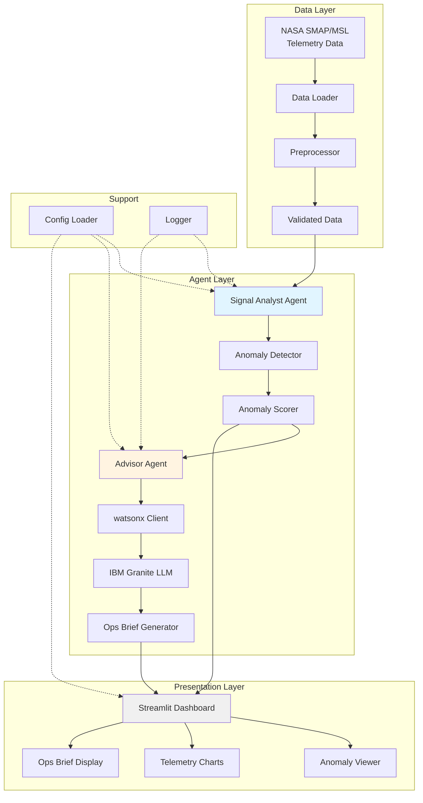
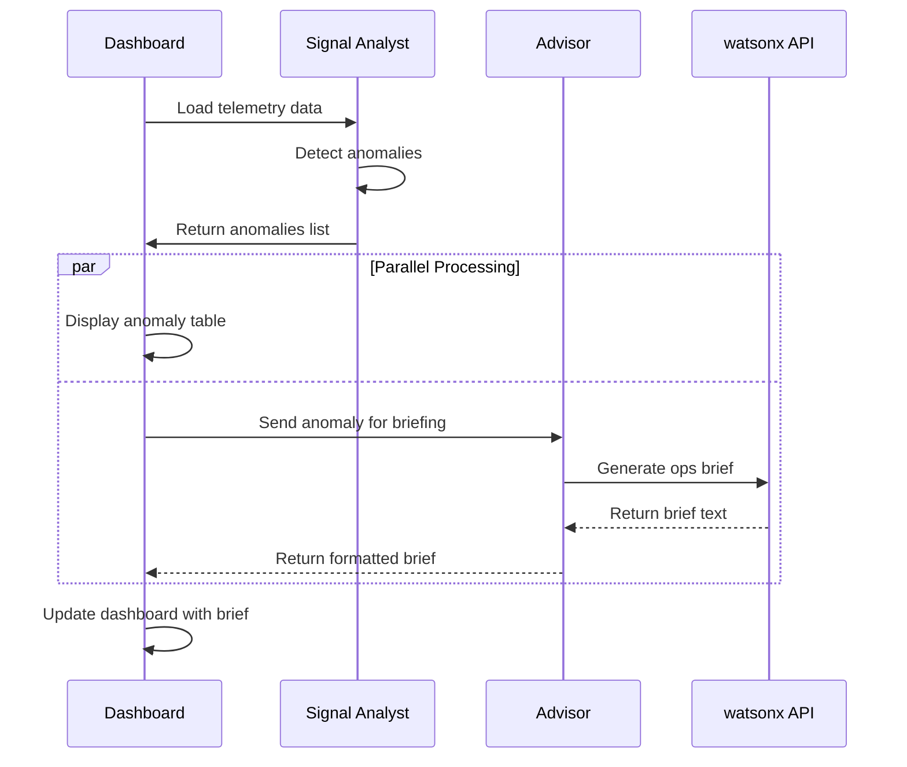

# Mission Watch - Project Structure Plan

## Overview
Multi-agent anomaly triage system for spacecraft telemetry with parallel agent architecture.

**Tech Stack**: Python 3.11, pandas, scikit-learn, Streamlit, IBM Granite/watsonx

---

## Folder Structure

```
OrbitGuard/
├── README.md                          # Project overview, setup, and usage
├── requirements.txt                   # Python dependencies
├── config.yaml                        # Configuration file (API keys, model params, paths)
├── .env.example                       # Environment variables template
├── .gitignore                         # Git ignore patterns
│
├── data/                              # Data storage directory
│   ├── raw/                           # Raw NASA SMAP/MSL telemetry data
│   ├── processed/                     # Cleaned/preprocessed data
│   └── anomalies/                     # Detected anomalies output
│
├── src/                               # Source code modules
│   ├── __init__.py
│   │
│   ├── data/                          # Data loading and preprocessing
│   │   ├── __init__.py
│   │   ├── loader.py                  # Load NASA telemetry datasets
│   │   ├── preprocessor.py            # Data cleaning and feature engineering
│   │   └── validator.py               # Data validation and quality checks
│   │
│   ├── agents/                        # Multi-agent system
│   │   ├── __init__.py
│   │   │
│   │   ├── signal_analyst/            # Anomaly detection agent
│   │   │   ├── __init__.py
│   │   │   ├── detector.py            # Core anomaly detection logic
│   │   │   ├── models.py              # ML models (Isolation Forest, etc.)
│   │   │   └── scorer.py              # Anomaly scoring and ranking
│   │   │
│   │   └── advisor/                   # Advisory agent (IBM Granite)
│   │       ├── __init__.py
│   │       ├── advisor.py             # Main advisor agent logic
│   │       ├── watsonx_client.py      # IBM watsonx API integration
│   │       └── prompt_templates.py    # LLM prompt templates for ops briefs
│   │
│   ├── dashboard/                     # Streamlit UI
│   │   ├── __init__.py
│   │   ├── app.py                     # Main Streamlit application
│   │   ├── components/                # Reusable UI components
│   │   │   ├── __init__.py
│   │   │   ├── anomaly_viewer.py      # Anomaly visualization component
│   │   │   ├── telemetry_charts.py    # Time-series charts
│   │   │   └── ops_brief_display.py   # Advisory output display
│   │   └── styles.css                 # Custom CSS styling
│   │
│   └── utils/                         # Shared utilities
│       ├── __init__.py
│       ├── config_loader.py           # Configuration management
│       ├── logger.py                  # Logging setup
│       └── helpers.py                 # Common helper functions
│
├── notebooks/                         # Jupyter notebooks (optional)
│   └── exploration.ipynb              # Data exploration and prototyping
│
└── docs/                              # Documentation
    ├── architecture.md                # System architecture diagram
    ├── data_schema.md                 # Telemetry data schema
    └── api_reference.md               # Module API documentation
```

---

## Module Responsibilities

### 1. Data Module (`src/data/`)

#### `loader.py`
- **Purpose**: Load NASA SMAP/MSL telemetry datasets from local storage
- **Key Functions**:
  - `load_telemetry_data(file_path)` - Load raw telemetry CSV/JSON
  - `load_batch(data_dir, date_range)` - Load multiple files by date
  - `get_available_datasets()` - List available local datasets
- **Dependencies**: pandas, pathlib

#### `preprocessor.py`
- **Purpose**: Clean and prepare telemetry data for analysis
- **Key Functions**:
  - `clean_telemetry(df)` - Handle missing values, outliers
  - `extract_features(df)` - Feature engineering for ML models
  - `normalize_timestamps(df)` - Standardize time formats
  - `create_sliding_windows(df, window_size)` - Time-series windowing
- **Dependencies**: pandas, numpy, scikit-learn

#### `validator.py`
- **Purpose**: Validate data quality and schema compliance
- **Key Functions**:
  - `validate_schema(df, expected_schema)` - Check column types
  - `check_data_quality(df)` - Detect data quality issues
  - `generate_quality_report(df)` - Summary statistics
- **Dependencies**: pandas

---

### 2. Signal Analyst Agent (`src/agents/signal_analyst/`)

#### `detector.py`
- **Purpose**: Orchestrate anomaly detection pipeline
- **Key Functions**:
  - `detect_anomalies(telemetry_data)` - Main detection workflow
  - `run_detection_pipeline(data_source)` - End-to-end pipeline
  - `save_anomalies(anomalies, output_path)` - Persist results
- **Dependencies**: pandas, models.py, scorer.py

#### `models.py`
- **Purpose**: Machine learning models for anomaly detection
- **Key Classes/Functions**:
  - `IsolationForestDetector` - Isolation Forest implementation
  - `StatisticalDetector` - Statistical methods (Z-score, IQR)
  - `EnsembleDetector` - Combine multiple detection methods
  - `train_model(data)` - Model training
  - `predict_anomalies(model, data)` - Inference
- **Dependencies**: scikit-learn, numpy

#### `scorer.py`
- **Purpose**: Score and rank detected anomalies by severity
- **Key Functions**:
  - `calculate_anomaly_score(anomaly)` - Severity scoring
  - `rank_anomalies(anomalies)` - Priority ranking
  - `filter_by_threshold(anomalies, threshold)` - Filter low-confidence
- **Dependencies**: numpy, pandas

---

### 3. Advisor Agent (`src/agents/advisor/`)

#### `advisor.py`
- **Purpose**: Generate plain-language operational briefs from anomalies
- **Key Functions**:
  - `generate_ops_brief(anomaly_data)` - Create advisory report
  - `analyze_anomaly_context(anomaly)` - Extract relevant context
  - `format_brief(raw_response)` - Structure LLM output
- **Dependencies**: watsonx_client.py, prompt_templates.py

#### `watsonx_client.py`
- **Purpose**: Interface with IBM watsonx/Granite API
- **Key Functions**:
  - `initialize_client(api_key, endpoint)` - Setup API connection
  - `generate_text(prompt, model_params)` - Call Granite model
  - `handle_api_errors(error)` - Error handling and retries
- **Dependencies**: requests, ibm-watsonx-ai (or similar SDK)

#### `prompt_templates.py`
- **Purpose**: LLM prompt engineering for ops briefs
- **Key Components**:
  - `ANOMALY_BRIEF_TEMPLATE` - Main brief generation prompt
  - `CONTEXT_ENRICHMENT_TEMPLATE` - Add domain context
  - `SEVERITY_ASSESSMENT_TEMPLATE` - Assess criticality
  - `build_prompt(anomaly, template)` - Construct final prompt
- **Dependencies**: string, jinja2 (optional)

---

### 4. Dashboard Module (`src/dashboard/`)

#### `app.py`
- **Purpose**: Main Streamlit application entry point
- **Key Functions**:
  - `main()` - App initialization and layout
  - `load_data_pipeline()` - Load and process telemetry
  - `run_agents()` - Execute Signal Analyst and Advisor in parallel
  - `display_results()` - Render dashboard components
- **Dependencies**: streamlit, components/*

#### `components/anomaly_viewer.py`
- **Purpose**: Display detected anomalies in interactive table/cards
- **Key Functions**:
  - `render_anomaly_table(anomalies)` - Tabular view
  - `render_anomaly_card(anomaly)` - Detailed card view
  - `add_filters(anomalies)` - Filter by severity, time, etc.
- **Dependencies**: streamlit, pandas

#### `components/telemetry_charts.py`
- **Purpose**: Visualize time-series telemetry data
- **Key Functions**:
  - `plot_telemetry_timeseries(data, anomalies)` - Line charts with anomaly markers
  - `plot_anomaly_distribution(anomalies)` - Histogram/heatmap
  - `plot_feature_importance(model)` - Feature contribution
- **Dependencies**: streamlit, plotly/matplotlib

#### `components/ops_brief_display.py`
- **Purpose**: Render AI-generated operational briefs
- **Key Functions**:
  - `render_brief(brief_text)` - Display formatted brief
  - `render_brief_history(briefs)` - Show past briefs
  - `export_brief(brief, format)` - Export as PDF/Markdown
- **Dependencies**: streamlit, markdown

---

### 5. Utilities Module (`src/utils/`)

#### `config_loader.py`
- **Purpose**: Load and manage configuration
- **Key Functions**:
  - `load_config(config_path)` - Parse YAML config
  - `get_config_value(key, default)` - Safe config access
  - `validate_config(config)` - Check required fields
- **Dependencies**: yaml, os

#### `logger.py`
- **Purpose**: Centralized logging setup
- **Key Functions**:
  - `setup_logger(name, level)` - Configure logger
  - `log_anomaly_detection(anomalies)` - Log detection events
  - `log_advisor_call(prompt, response)` - Log LLM interactions
- **Dependencies**: logging, datetime

#### `helpers.py`
- **Purpose**: Common utility functions
- **Key Functions**:
  - `format_timestamp(ts)` - Timestamp formatting
  - `calculate_metrics(predictions, ground_truth)` - Performance metrics
  - `create_directory_structure()` - Initialize project folders
- **Dependencies**: datetime, pathlib

---

## Configuration File (`config.yaml`)

```yaml
# Data paths
data:
  raw_dir: "data/raw"
  processed_dir: "data/processed"
  anomalies_dir: "data/anomalies"

# Signal Analyst settings
signal_analyst:
  model_type: "isolation_forest"  # or "statistical", "ensemble"
  contamination: 0.05
  n_estimators: 100
  anomaly_threshold: 0.7

# Advisor settings
advisor:
  model_name: "ibm/granite-13b-instruct-v2"
  api_endpoint: "https://us-south.ml.cloud.ibm.com"
  max_tokens: 500
  temperature: 0.3

# Dashboard settings
dashboard:
  title: "Mission Watch - Spacecraft Telemetry Triage"
  refresh_interval: 60  # seconds
  max_anomalies_display: 50

# Logging
logging:
  level: "INFO"
  log_file: "logs/mission_watch.log"
```

---

## Requirements.txt Specification

```txt
# Core dependencies
python>=3.11

# Data processing
pandas>=2.0.0
numpy>=1.24.0

# Machine learning
scikit-learn>=1.3.0

# IBM watsonx/Granite
ibm-watsonx-ai>=0.2.0
# OR requests>=2.31.0 (if using REST API directly)

# Dashboard
streamlit>=1.28.0
plotly>=5.17.0
# OR matplotlib>=3.7.0 (alternative visualization)

# Configuration
pyyaml>=6.0

# Utilities
python-dotenv>=1.0.0
```

---

## README.md Skeleton

```markdown
# Mission Watch 🛰️

Multi-agent anomaly triage system for spacecraft telemetry monitoring.

## Overview

Mission Watch analyzes NASA SMAP/MSL telemetry data using a two-agent system:
- **Signal Analyst**: Detects anomalies using machine learning
- **Advisor**: Generates plain-language operational briefs using IBM Granite

## Features

- Real-time anomaly detection in spacecraft telemetry
- AI-powered operational briefs for mission control
- Interactive Streamlit dashboard
- Parallel agent architecture for fast processing

## Tech Stack

- Python 3.11
- pandas, scikit-learn (data & ML)
- IBM watsonx/Granite (LLM)
- Streamlit (dashboard)

## Installation

1. Clone the repository
2. Install dependencies: `pip install -r requirements.txt`
3. Configure API keys in `config.yaml`
4. Place NASA telemetry data in `data/raw/`

## Usage

Run the dashboard:
```bash
streamlit run src/dashboard/app.py
```

## Project Structure

See [PROJECT_STRUCTURE.md](PROJECT_STRUCTURE.md) for detailed architecture.

## Configuration

Edit `config.yaml` to customize:
- Detection model parameters
- IBM watsonx API settings
- Dashboard preferences

## Data

Expected telemetry data format:
- CSV/JSON files with timestamp, sensor readings
- See `docs/data_schema.md` for full schema

## License

[Your License]

## Hackathon

Built for [Hackathon Name] - [Date]
```

---

## Architecture Diagram (Mermaid)



---

## Parallel Agent Execution Flow



---

## Next Steps

1. Review this structure with stakeholders
2. Create initial folder structure and empty files
3. Implement data loading module first
4. Build Signal Analyst agent
5. Integrate Advisor agent with IBM watsonx
6. Develop Streamlit dashboard
7. Test end-to-end pipeline
8. Prepare hackathon demo

---

## Notes

- **Parallel Architecture**: Signal Analyst and Advisor can run independently, allowing dashboard to display anomalies immediately while briefs generate in background
- **Scalability**: Modular design allows easy addition of new agents or detection methods
- **Configuration-Driven**: All parameters externalized to `config.yaml` for easy tuning
- **MVP Focus**: No testing infrastructure for hackathon speed, but structure supports future test addition
