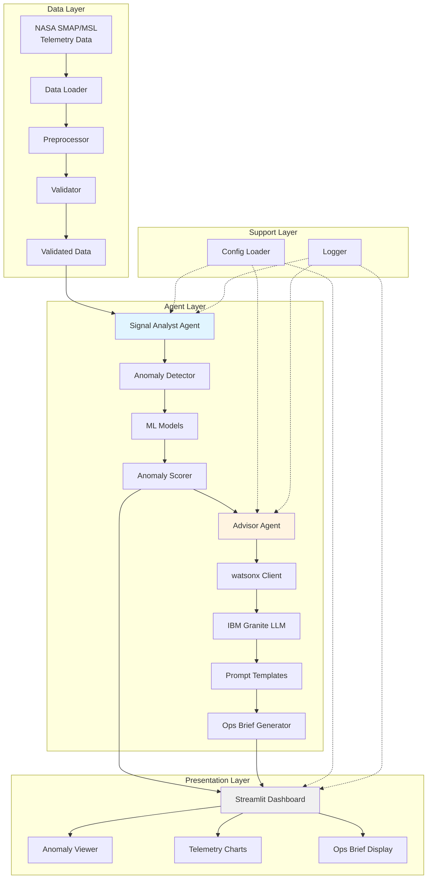

# Mission Watch - System Architecture

## Overview

Mission Watch implements a parallel multi-agent architecture for spacecraft telemetry anomaly triage.

## Architecture Diagram



## Data Flow

### 1. Data Ingestion
```
Raw Telemetry → Loader → Preprocessor → Validator → Clean Data
```

### 2. Anomaly Detection (Signal Analyst)
```
Clean Data → Feature Extraction → ML Model → Anomaly Scores → Ranked Anomalies
```

### 3. Brief Generation (Advisor)
```
Anomaly Data → Context Analysis → Prompt Builder → LLM Call → Formatted Brief
```

### 4. Parallel Execution
```
Dashboard Trigger
    ├─→ Signal Analyst (async) → Display Anomalies
    └─→ Advisor (async) → Display Briefs
```

## Component Interactions

### Signal Analyst Agent
- **Input**: Preprocessed telemetry DataFrame
- **Processing**: 
  1. Feature extraction
  2. Model inference (Isolation Forest/Statistical)
  3. Anomaly scoring and ranking
- **Output**: DataFrame with anomalies and confidence scores

### Advisor Agent
- **Input**: Anomaly data dictionary
- **Processing**:
  1. Context enrichment
  2. Prompt construction
  3. LLM API call
  4. Response formatting
- **Output**: Plain-language operational brief

### Dashboard
- **Input**: User interactions, agent outputs
- **Processing**:
  1. Data loading and caching
  2. Parallel agent execution
  3. Real-time result rendering
- **Output**: Interactive visualizations and briefs

## Technology Stack

| Layer | Technologies |
|-------|-------------|
| Data Processing | pandas, numpy |
| ML Models | scikit-learn (Isolation Forest) |
| LLM | IBM watsonx, Granite |
| Dashboard | Streamlit, Plotly |
| Configuration | YAML, python-dotenv |
| Logging | Python logging |

## Scalability Considerations

### Current (MVP)
- Single-threaded data loading
- Sequential batch processing
- Local file storage
- In-memory caching

### Future Enhancements
- Distributed processing (Dask/Ray)
- Real-time streaming (Kafka)
- Cloud storage (S3/Cloud Storage)
- Model serving (MLflow)
- Database backend (PostgreSQL/TimescaleDB)

## Security Architecture

- API keys stored in `.env` (gitignored)
- Configuration validation on startup
- Input sanitization for LLM prompts
- Logging of all API interactions
- No sensitive data in logs

## Error Handling Strategy

1. **Data Layer**: Validation errors → Log + Skip file
2. **Agent Layer**: Model errors → Fallback to statistical methods
3. **LLM Layer**: API errors → Retry with exponential backoff
4. **Dashboard**: Component errors → Display error message, continue

## Performance Targets

- Data loading: < 5 seconds for 1M rows
- Anomaly detection: < 10 seconds for 1M rows
- Brief generation: < 5 seconds per anomaly
- Dashboard refresh: < 2 seconds
